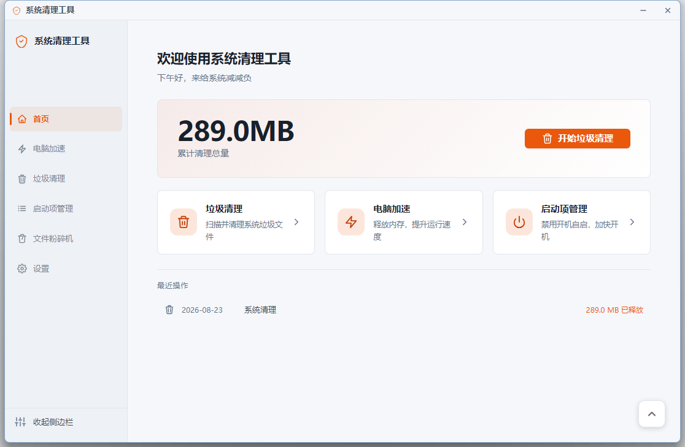

# 系统清理助手

轻若分毫的 Windows 系统优化工具 —— 基于 **Tauri 2 + Rust** 构建，安装包仅 **1.74 MB**。

> 垃圾清理 · 电脑加速 · 启动项管理 · 文件粉碎机

## 特性

- **📦 极致轻量**：复用系统自带 WebView2，无需为每个用户捆绑一份 Chromium，安装包对比 Electron 方案减少 97%
- **🧹 垃圾清理**：内置规则引擎，覆盖系统临时文件、浏览器缓存、回收站等；结果按风险分组，高危项需确认后才执行
- **⚡ 电脑加速**：一键扫描可优化项，逐条建议且全部保留「恢复」入口
- **🚀 启动项管理**：软件 / 计划任务 / 系统服务 / 右键菜单 / 资源管理器插件五个维度全面接管，支持禁用、恢复与 UAC 提权删除
- **🗑️ 文件粉碎机**：多次覆写，整目录递归粉碎，进度实时可视、可取消
- **🎨 个性化**：六套配色方案一键切换，开机自启与关闭确认随心配置
- **🔒 纯净本地**：无广告、无捆绑、无上传，所有数据只存在你自己的电脑里

## 界面



## 技术架构

| 层 | 技术 |
|---|---|
| 桌面框架 | Tauri 2 |
| 后端 | Rust（原生编译，无 VM） |
| 前端 | 原生 HTML / CSS / JavaScript（无打包器） |
| 渲染 | 系统自带 WebView2 |
| 安装包 | NSIS（仅当前用户安装，简体中文） |

## 从源码构建

```bash
# 依赖: Rust (stable, MSVC) + Node.js + WebView2 Runtime (Win10 1803+ 自带)

npm install        # 安装 @tauri-apps/cli
npm run build      # 产物位于 src-tauri/target/release/bundle/nsis/
```

开发调试：

```bash
npm run dev
```

## 目录结构

```
├── src/ui/            # 前端 (入口 index.html, 无构建步骤)
│   ├── js/            #   app.js 应用逻辑 · pages.js 页面渲染 · api-shim.js IPC 桥
│   ├── rules/         #   清理/加速/启动项规则引擎数据 (8 个 JSON)
│   └── styles/        #   全部样式与设计令牌
├── src-tauri/         # Rust 后端 (34 个 IPC 命令)
│   ├── src/           #   业务: 扫描调度 · 清理执行 · 启动项 · 粉碎机 · UAC 提权 · 图标提取
│   ├── capabilities/  #   Tauri 权限声明
│   └── icons/         #   应用图标
└── 杀软误报处理指南.md  # 分发时杀软误报的说明与申诉指引
```

## 常见问题

**杀毒软件提示风险？**
清理类软件会操作注册表与计划任务，部分杀软会保守提示。本工具行为完全透明，可加入信任区，详见 [杀软误报处理指南](./杀软误报处理指南.md)。

**需要管理员权限吗？**
日常清理无需提权；仅删除受系统保护的启动项时会弹出 UAC 确认。

## 许可

Copyright © 2026 [GeLith](https://github.com/GeLith). 保留所有权利。
